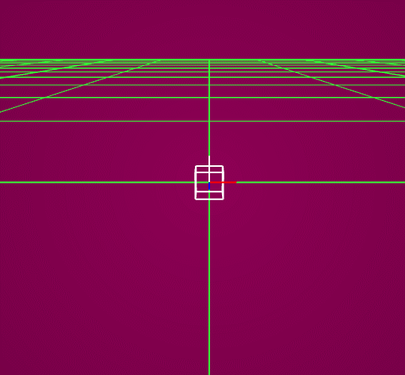

# JoystickController

This application  enables the STM32 to send data to a computer through serial comunication (AURT) with the help of a joystick controller. An application for Windows has been programmed using the openFrameworks toolkit in order to desmonstrate how one is able to control objects from other applications or charcters from video games. 

## Software Needed: 
  - MikroC PRO for ARM
  - Visual Studio 
  - openFrameworks

## Hardware Needed: 
  - EasyMx PRO v7 for STM32
  - SparkFun Joystick Shield Kit
  
## Use MikroC's Library Manager to include the following libraries:
  - ADC
  - Button
  - Conversions
  - C_string
  - MemManager
  - UART

## Demo

  

